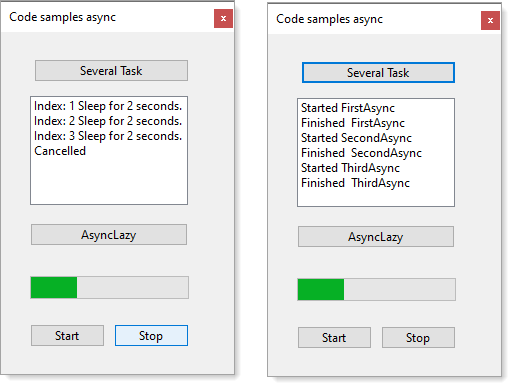
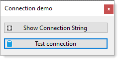

# About

Sample Task examples





Simple code sample showing how to read a `connection string` from `appsettings.json`. 

In this project, SQL-Server.

Project is setup for `C#9`, `.NET Core 5`, the following is from the project file.

```xml
<PropertyGroup>
  <OutputType>WinExe</OutputType>
  <LangVersion>9.0</LangVersion>
  <TargetFramework>net5.0-windows</TargetFramework>
  <UseWindowsForms>true</UseWindowsForms>
</PropertyGroup
```


**appsettings.json**

```json
{
  "database": {
    "DatabaseServer": ".\\SQLEXPRESS",
    "Catalog": "School",
    "IntegratedSecurity": "true",
    "UsingLogging": "true",
    "Timeout": 5 
  }
}
```

# NuGet packages 

These packages are required for reading appsettings.json

:heavy_check_mark: [microsoft.extensions.configuration](https://www.nuget.org/packages/Microsoft.Extensions.Configuration/) <br/>
:heavy_check_mark: [microsoft.extensions.configuration.binder](https://www.nuget.org/packages/Microsoft.Extensions.Configuration.Binder/)<br/>
:heavy_check_mark: [microsoft.extensions.configuration.FileExensions](https://www.nuget.org/packages/Microsoft.Extensions.Configuration.FileExtensions/)<br/>
:heavy_check_mark: [microsoft.extensions.configuration.Json](https://www.nuget.org/packages/Microsoft.Extensions.Configuration.Json/)

This package provides the data provider for SQL Server. These classes provide access to versions of SQL Server and encapsulate database-specific protocols, including tabular data stream (TDS)

:heavy_check_mark: [System.Data.SqlClient](https://www.nuget.org/packages/System.Data.SqlClient/)
