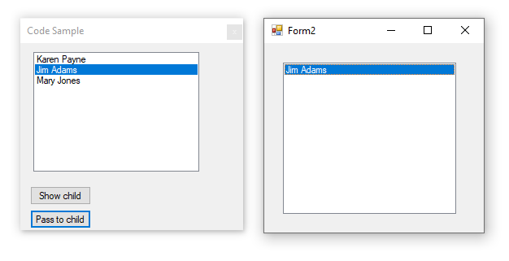

# About

Simple example for passing information from main form to child form.



```csharp
public static class Factory
{
    private static Broadcaster _broadcaster;

    public static Broadcaster Broadcaster()
    {
        return _broadcaster ?? (_broadcaster = new Broadcaster());
    }
}
```
</br>

```csharp
public class Broadcaster
{
    private readonly Collection<IListener> _listeners = new Collection<IListener>();

 
    [DebuggerStepThrough()]
    public void Broadcast(Person person, Form sender)
    {
        foreach (IListener listener in _listeners)
        {
            listener.OnListen(person, sender);
        }
    }

    public void AddListener(IListener listener)
    {
        _listeners.Add(listener);
    }

    public void RemoveListener(IListener listener)
    {

        for (int index = 0; index < _listeners.Count; index++)
        {
            if (_listeners[index].Equals(listener))
            {
                _listeners.Remove(_listeners[index]);
            }
        }
    }
}
```