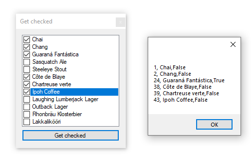
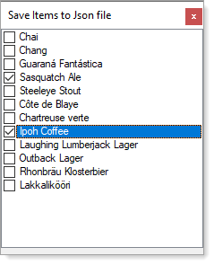

# About

Load data from [NortWind database](https://gist.github.com/karenpayneoregon/40a6e1158ff29819286a39b7f1ed1ae8), product table into a `CheckedListBox`.

Provides code to 
- Get checked items and the basics to get at all properties
- Pass a Product item from child form to main form via delegate/event



```csharp
public delegate void OnProductSelected(Product product);
public event OnProductSelected ProductSelected;
```

# Save checked



```json
[
  {
    "ProductID": 34,
    "Index": 3
  },
  {
    "ProductID": 43,
    "Index": 7
  }
]
```
