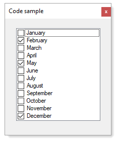
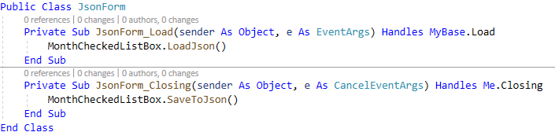

# About

Shows how to load a `CheckedListBox` from `Json` and save checked state.

 

**Form code**

**Classes/Modules**

| Class  | Description|
| :--- | :--- |
| MonthItem | for storing information stored in CheckedListBox |
| CheckedListBoxExtensions | contained language extensions to load and save data in the CheckedListBox |
| Mocked | has code to show how to create the initial Json file |

too much code?

It is all how one sees things. Some may think it's too much but small solutions are not always the best.

