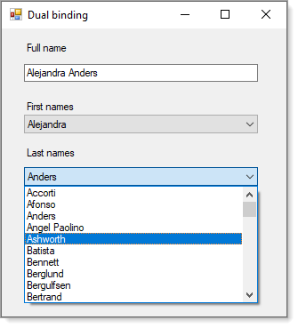

# About

Shows one method to update a TextBox from two different list of strings. Note we can also do this with concrete classes such as FirstName and LastName classes included but see no reason to here.

