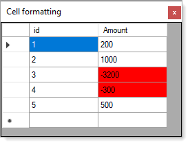

# About

Simple cell formatting example



</br>

```csharp
private const string _amountColumnName = "Amount";
private void DataGridView1OnCellFormatting(object sender, DataGridViewCellFormattingEventArgs e)
{
    /*
     * DbNull check
     */
    DataRowView drv = ((DataRowView) _bindingSource.Current);
    DataRow row = drv.Row;
    if (row["Amount"] == DBNull.Value)
    {
        return;
    }

    
    if (!dataGridView1.Columns[e.ColumnIndex].Name.Equals(_amountColumnName)) return;
    if (e.Value == null || !int.TryParse(e.Value.ToString(), out var amount)) return;
    
    dataGridView1.Rows[e.RowIndex].Cells[_amountColumnName].Style.BackColor = amount >0 ? 
        Color.Empty : 
        Color.Red;

}
```