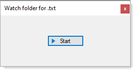

# About

Basic `FileSystemWatcher` example which monitors a folder for new text files and when detected moves them to another folder.

# Important

- Before running, change the first path to the folder to watch, second folder for where to move files too in the form.

```csharp
private readonly FileOperations _fileOperations = 
    new FileOperations("C:\\OED","C:\\OED\\Target", "*.txt");
```

</br>

- On form closing the watcher is stopped

</br>

