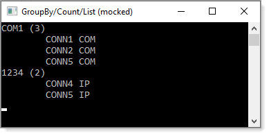
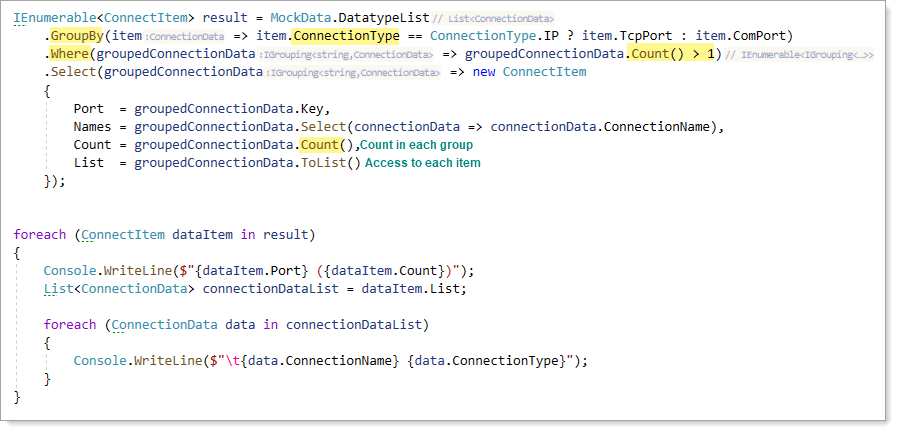

# About

Shows how to perform a GroupBy with count

- Create in .NET Core 5, C#9 so if using .NET Framework say 4.8 or lower this will not compile but look at the code will make sense.
- Uses mocked data.



Using `ConnectionData`, group by `ConnectionType` property.

```csharp
namespace GroupByWithCountMocked.Classes
{
    public enum ConnectionType
    {
        IP,
        COM
    }
    public class ConnectionData
    {
        public ConnectionType ConnectionType { get; set; }
        public string ComPort { get; set; }
        public string TcpPort { get; set; }
        public string ConnectionName { get; set; }
        

        public override string ToString() => ConnectionName;

    }

}
```
</br>

In this case the property to group by is an emum but with minor tweaks will work with string, numerics, dates and whatever you can think up.

