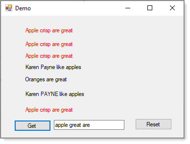

Temp project, will delete before Monday.




```
Public Module StringExtensions
    <Runtime.CompilerServices.Extension>
    Public Function ContainsInsensitive(source As String, toCheck As String) As Boolean
        Return source.IndexOf(toCheck, StringComparison.OrdinalIgnoreCase) >= 0
    End Function
    <Runtime.CompilerServices.Extension>
    Public Function ContainsAll(source As String, ParamArray values() As String) As Boolean
        Return values.All(Function(x) source.ContainsInsensitive(x))
    End Function

End Module
```

Form code

```
Dim parts = ItemTextBox.Text.Split(" "c)

If LabelList.Any(Function(currentLabel) currentLabel.Text.ContainsAll(parts)) Then
    LabelList.ForEach(
        Sub(label)
            If label.Text.ContainsAll(parts) Then
                label.ForeColor = Color.Red
            End If
        End Sub)
End If

```

