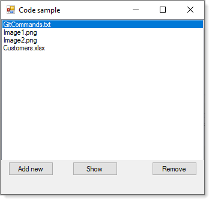

# About

Conceptual/basic example to show a file name in a ListBox while storing path and file name in a list. Data is stored in a Json file using NewtonSoft (native .NET Json classes can also be used).



**Shows**

:heavy_check_mark: Loading files

:heavy_check_mark: Adding files

:heavy_check_mark: Saving files

## File structure

```json
[
  {
    "FullName": "C:\\Files\\Document1.docx"
  },
  {
    "FullName": "C:\\Storage\\Pictures\\Image1.png"
  },
  {
    "FullName": "C:\\Storage\\Pictures\\Image2.png"
  },
  {
    "FullName": "C:\\Excel\\Customers.xlsx"
  },
  {
    "FullName": "D:\\Docs\\readme.md"
  }
]
```