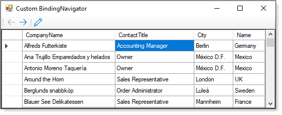

# About

Cheap way to create a simple custom BindingNavigator.

- Buttons use default properties but `open for changing` to whatever a developer may want.
- Button events are wired in a form rather than get deep into movement logic in the new control.
- Button image are from Visual Studio image library, standard images could be used by dropping a standard BindingNavigator on a form, select form resources and export to a file.

### Sreenshot

:green_circle: Custom control is C# (in this project [Source](https://github.com/karenpayneoregon/windows-forms-csharp/tree/Version1/WinControlsLibrary) ) , for VB.NET add the class project to your Visual Studio solution and then add a reference to this project to your project, build then drop from the toolbar the control. Wire up events and done.