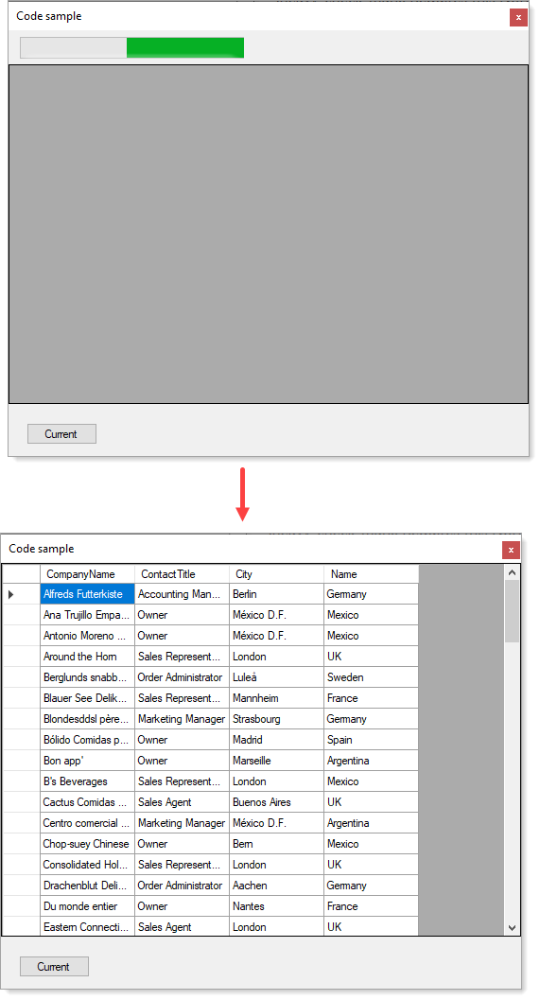

There are several different code samples in this project

:heavy_check_mark: Requires this NorthWind [Database script](https://gist.github.com/karenpayneoregon/c3361a4d4503c8851dcb43f8d6b2526f) to run first.

---

Proactive memory leak issues in BindingListForm for a Microsoft Q&A forum questions

---

Load DataGridView async with Progressbar written with VS2019, .NET Framework 4.8.

- Progressbar is on a panel which is hidden once loading in the form has completed.
- Uses a named value tuple to return results

# Framework notes

Done with .NET Framework 4.8 because I first started off answering questions using .NET Core and learned most people were not using Core which is why I used .NET Framework classic.