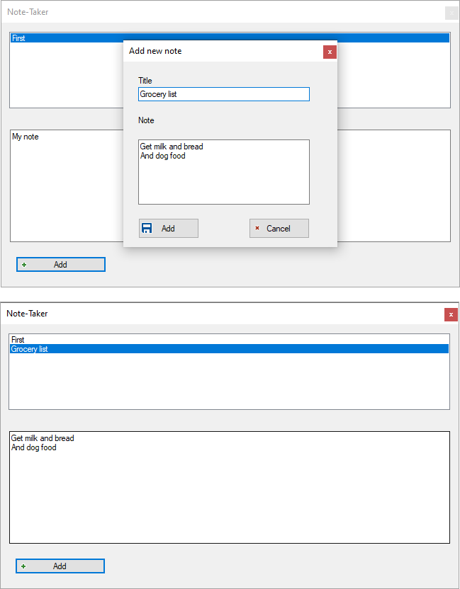

# About

Simple code sample for sharing data between two forms. In this case clicking the `Add` button in the child form uses an event to pass information to the calling form while clicking `Cancel` nothing is passed back to the calling form.

Alternate is to have a property in the child form that if DialogResult is Ok access the property before disposing the child form.

