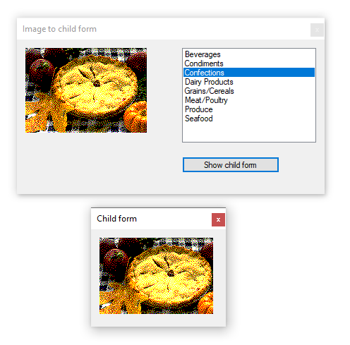

# About

Provides minimal code to show an `image` in a `PictureBox` from a SQL-Server database (script included to create the required table) table with code to pass a byte array representation of the current image selected from a ListBox to a child form.

**DataGridView**

To do this with a `DataGridView`, setup DataGridView columns for all columns read from the database followed by setting the DataGridView DataSource to a BindingSource which is populated as in the current example. To display the image in the child form, cast Current property of the BindingSource as done currently and pass to the child form as done with the PictureBox.

**Note**

The key to doing this is to using a BindingSource rather than populating either control by bypassing the controls DataSource.

