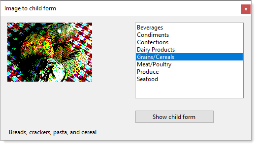

# About

Uses `.NET Core`, `C#9` `EF Core 5.0.9` to read records from a modified NorthWind database to display in a PictureBox.

Connection string is read from appsettings.json using `Microsoft.Extensions.Configuration`.


```json
{
  "database": {
    "DatabaseServer": ".\\SQLEXPRESS",
    "Catalog": "NorthWind2020",
    "IntegratedSecurity": "true",
    "UsingLogging": "true"
  }
}
```

</br>

**Screenshot**



## Packages

```xml
<ItemGroup>
  <PackageReference Include="Microsoft.EntityFrameworkCore.SqlServer" Version="5.0.9" />
  <PackageReference Include="Microsoft.Extensions.Configuration" Version="5.0.0" />
  <PackageReference Include="Microsoft.Extensions.Configuration.Binder" Version="5.0.0" />
  <PackageReference Include="Microsoft.Extensions.Configuration.FileExtensions" Version="5.0.0" />
  <PackageReference Include="Microsoft.Extensions.Configuration.Json" Version="5.0.0" />
  <PackageReference Include="Newtonsoft.Json" Version="12.0.3" />
</ItemGroup>
```