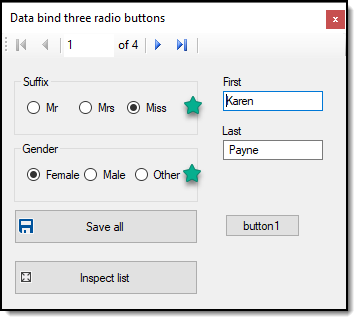
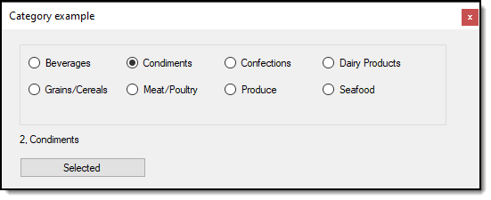

# About

Demonstrates data binding properties of a class to grouped RadioButton controls.

## Requires to run sample code

- .NET Framework 4.8
- Core 3.1
- C# 9

## See also

Microsoft TechNet article  [Windows forms (C#): Data Binding ListBox/ComboBox](https://social.technet.microsoft.com/wiki/contents/articles/53599.windows-forms-c-data-binding-listboxcombobox.aspx)

## Notes

- Will work with .NET Framework 4.7 and higher and need not be Core project as this code was originally done in VS2017 while the sample code has been ported to Core. 
- With .NET Core 5 there is no BindingNavigator which is why the code was not in .NET Core 3.1
- Data is read from a comma-delimited file and will work with data from other sources like a database using conventional data access, Entity Framework 6 or Entity Framework Core.
- Save all button writes current data back to the original data source.
- Inspect list button provides a peek at current people in the list.

#### Data binding



#### Dynamically created 



```csharp
using System.Collections.Generic;
using System.Drawing;
using System.Windows.Forms;

namespace RadioButtonBinding.Classes
{
    public class CreateRadioButtons
    {
        public List<RadioButton> RadioButtons { get; set; }
        public string RadioBaseName { get; set; }
        public static int Base { get; set; }
        public static int BaseAddition { get; set; }
        /// <summary>
        /// Parent control to place RadioButton controls on
        /// </summary>
        public static Control ParentControl { get; set; }

        /// <summary>
        /// Create one RadioButton for each category read from a comma delimited
        /// file. Could also change from reading a file to reading from a database
        /// table.
        /// </summary>
        public static void CreateCategoryRadioButtons()
        {
            var categories = DataOperations.ReadCategoriesFromCommaDelimitedFile();

            foreach (var category in categories)
            {
                RadioButton radioButton = new()
                {
                    Name = $"{category.Name}RadioButton",
                    Text = category.Name,
                    Location = new Point(5, Base),
                    Parent = ParentControl,
                    Tag = category.CategoryId,
                    Visible = true
                };
                
                ParentControl.Controls.Add(radioButton);
                Base += BaseAddition;
            }
        }
    }
}
```

#### Generic data binding

```csharp
/// <summary>
/// Provides generic data binding for a RadioButton
/// </summary>
public static class ControlHelpers
{
    public static void RadioCheckedBinding<T>(RadioButton radio, object dataSource, string dataMember, T trueValue)
    {
        var binding = new Binding(nameof(RadioButton.Checked), 
            dataSource, dataMember, true, DataSourceUpdateMode.OnPropertyChanged);
        
        binding.Parse += (s, args) =>
        {
            if ((bool)args.Value)
            {
                args.Value = trueValue;
            }
        };
        
        binding.Format += (s, args) => args.Value = ((T)args.Value).Equals(trueValue);
        radio.DataBindings.Add(binding);
    }
}
```
