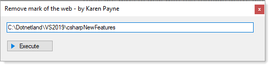

# About

When decompressing a zip file downloaded from a web site or downloaded from a GitHub repository, the Windows operating system marks files as blocked which is known as `mark of the web`.

This utility accepts a folder which is used in a PowerShell script executed in this C# executable to remove the `mark of the web`. 

