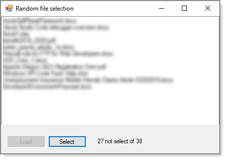

# About	

Select a random file from a list of files from a specific folder.



Container class

```csharp
public class FileItem
{
    public string FolderName { get; set; }
    public string FileName { get; set; }
    public bool Selected { get; set; }
    public override string ToString() => FileName;
}
```

Extension to Shuffle randomly

```csharp
public static class Extensions
{
    private static readonly Random random = new Random();

    public static void Shuffle<T>(this IList<T> list)
    {
        int count = list.Count;
        
        while (count > 1)
        {
            count--;
            
            int rnd = random.Next(count + 1);
            
            T value = list[rnd];
            list[rnd] = list[count];
            list[count] = value;
        }
    }
}
```

File operations

```csharp
public class FileOperations
{
    
    public static List<FileItem> GetFilesFromPath(string folderName, string extension = "*.*") =>
        Directory.GetFiles(folderName, extension).Select(file => new FileItem()
        {
            FileName = Path.GetFileName(file), 
            FolderName = folderName
        }).ToList();
}
```

Form code

```csharp
using System;
using System.Collections.Generic;
using System.IO;
using System.Linq;
using System.Windows.Forms;
using SelectRandomFile.Classes;

namespace SelectRandomFile
{

    public partial class Form1 : Form
    {
        private readonly BindingSource _bindingSource = new BindingSource();
        public Form1()
        {
            InitializeComponent();
            SelectButton.Enabled = false;
            label1.Text = "";
        }
        
        private void SelectButton_Click(object sender, EventArgs e)
        {
            var fileItemsList = ((List<FileItem>) _bindingSource.DataSource);
            
            fileItemsList.Shuffle();
            
            var fileItem = fileItemsList.FirstOrDefault(item => item.Selected == false);
            if (fileItem != null)
            {
                fileItem.Selected = true;
                listBox1.Items.Add(fileItem.FileName);
            }


            var count = fileItemsList.Count(item => item.Selected == false);

            label1.Text = $"{count} not select of {fileItemsList.Count}";

            if (count != 0) return;
            SelectButton.Enabled = false;
            LoadButton.Enabled = true;

        }

        private void LoadButton_Click(object sender, EventArgs e)
        {
            string folderName = "TODO";

            if (!Directory.Exists(folderName)) return;
            
            listBox1.Items.Clear();
            label1.Text = "";

            SelectButton.Enabled = true;

            _bindingSource.DataSource = FileOperations.GetFilesFromPath(folderName);

            LoadButton.Enabled = false;
        }
    }
}
```