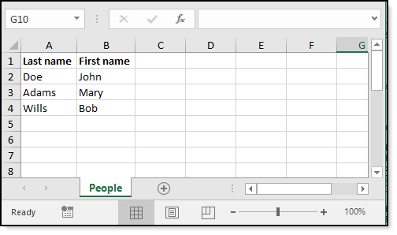

# About

Read data from SQL-Server to a DataTable then in turn sets a DataGridView.DataSource to the DataTable. There is a button to export the DataTable to Excel using the following code shown below. Note there is code to perform formatting of cells.

- To run perform a NuGet restore packages
- Run script.sql
- Build/run
- There is a file named Customers.xlsx in the root of the project which was generated with code provided.

# Important

**DO NOT** generate the excel file, open it then try another export while the Exel file is open as this will generate a runtime exception.

# Compiled

- x64
- Framework 4.8

# NuGet packages used

:heavy_check_mark: [SpreadsheetLight](https://www.nuget.org/packages/SpreadsheetLight/) **version 3.4.9**

:heavy_check_mark: [DocumentFormat.OpenXml](https://www.nuget.org/packages/DocumentFormat.OpenXml/) **version 2.11.3**

To verify the correct NuGet packages are installed, run the following command from `Package Manager Console`.

:running_man: `get-Package | ft -AutoSize`

The result should be

| id | Versions | 
| :---- | :---- | 
| DocumentFormat.OpenXml | {2.11.3} | 
| SpreadsheetLight | (3.4.9) | 
| System.Drawing.Common | {5.0.0} | 
| System.IO.FileSystem.Primitives | {4.3.0} |
| System.IO.Packaging | {4.7.0} | 


# Import operation

```csharp
Imports SpreadsheetLight

Public Class ExcelOperations
    Public Shared Sub SimpleExportRaw(pFileName As String, pSheetName As String, pDataTable As DataTable, pColumnHeaders As Boolean)

        Using doc As New SLDocument()
            doc.SelectWorksheet(pSheetName)
            doc.ImportDataTable(1, SLConvert.ToColumnIndex("A"), pDataTable, pColumnHeaders)

            Dim style As New SLStyle()
            style.FormatCode = "MM/dd//yyyy"
            doc.SetColumnStyle(11, style)

            style.Font.Bold = True
            doc.SetRowStyle(1, 1, style)

            Dim stats = doc.GetWorksheetStatistics()

            doc.AutoFitColumn(1, stats.EndColumnIndex)

            doc.RenameWorksheet(SLDocument.DefaultFirstSheetName, pSheetName)

            doc.SaveAs(pFileName)
        End Using

    End Sub
End Class
```

# Populate cells




:heavy_check_mark: Data container

```csharp
Public Class Person
    Public Property FirstName() As String
    Public Property LastName() As String
End Class
```

:heavy_check_mark: mocked data

```csharp
Public Class PeopleData
    Public Shared Function List() As List(Of Person)
        Return New List(Of Person) From {
            New Person() With {.FirstName = "John", .LastName = "Doe"},
            New Person() With {.FirstName = "Mary", .LastName = "Adams"},
            New Person() With {.FirstName = "Bob", .LastName = "Wills"}}
    End Function
End Class
```

Code to 

:heavy_check_mark: Populate sheet

:heavy_check_mark: Style header row

:heavy_check_mark: Auto-size columns

:heavy_check_mark: Rename default sheet name

:heavy_check_mark: Save to disk


```csharp
Public Shared Function CreateAndPopulate() As Boolean

    Dim success = True
    Try
        Using doc As New SLDocument()

            Dim style As New SLStyle

            style.Font.Bold = True
            doc.SetRowStyle(1, 1, style)

            doc.SetCellValue("A1", "Last name")
            doc.SetCellValue("B1", "First name")

            Dim people = PeopleData.List()

            Dim rowIndex = 0

            For Each person In people
                doc.SetCellValue($"A{rowIndex + 2}", people(rowIndex).LastName)
                doc.SetCellValue($"B{rowIndex + 2}", people(rowIndex).FirstName)
                rowIndex += 1
            Next


            Dim stats = doc.GetWorksheetStatistics()

            doc.AutoFitColumn(1, stats.EndColumnIndex)
            doc.RenameWorksheet(SLDocument.DefaultFirstSheetName, "People")

            doc.SaveAs("PeopleData.xlsx")

        End Using
    Catch ex As Exception
        Console.WriteLine($"{ex.Message}")
        success = False
    End Try

    Return success

End Function
```


