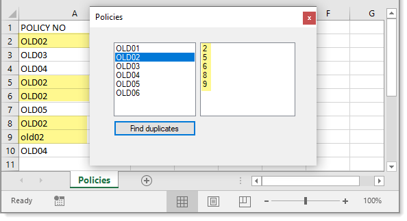

# About

A code sample showing how to find duplicates in a sheet by column index.



# Not coded

- How to update cell values via SpreadSheetLight although by reading the docs (downloadable from SpreadheetLight web site) it's extemely easy to set cell values.

Example of setting a cell value by column character

```csharp
document.SetCellValue("A1", "Last name");
```

or 

```csharp
document.SetCellValue($"{SLConvert.ToColumnName(1)}2", "some value");
``` 

# Compiled under

- Framework 4.8

# NuGet packages used

:heavy_check_mark: [SpreadsheetLight](https://www.nuget.org/packages/SpreadsheetLight/) **version 3.4.9**

:heavy_check_mark: [DocumentFormat.OpenXml](https://www.nuget.org/packages/DocumentFormat.OpenXml/) **version 2.11.3**

To verify the correct NuGet packages are installed, run the following command from `Package Manager Console`.

:running_man: `get-Package | ft -AutoSize`