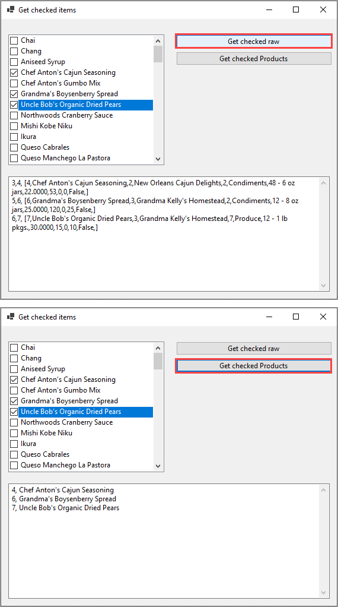

# About

Working with [CheckedListBox](https://docs.microsoft.com/en-us/dotnet/api/system.windows.forms.checkedlistbox?view=net-5.0) in windows forms.

- Reads data from SQL-Server into a DataTable and presented in a CheckedListBox.
- Demonstrates to CheckedListBox extensions for obtaining checked items.
- [Database script](https://gist.github.com/karenpayneoregon/c3361a4d4503c8851dcb43f8d6b2526f), make sure to get with `view the full file`.


### Notes

- [CancellationTokenSource](https://docs.microsoft.com/en-us/dotnet/api/system.threading.cancellationtokensource?view=net-5.0) is not used at this time, here for another code sample
- Column for `DisplayMember` is `not nullable`
- Column for primary key is auto-incrementing

# Extension methods


```csharp
public static partial class CheckedListBoxExtensions
{
    /// <summary>
    /// Raw method for inspecting data in a <see cref="CheckedListBox"/> where the DataSource is a <see cref="DataTable"/>
    /// </summary>
    /// <param name="sender"></param>
    /// <param name="primaryKeyName">Primary key in DataTable</param>
    /// <returns>List of <see cref="CheckedData"/></returns>
    public static List<CheckedData> IndexList(this CheckedListBox sender, string primaryKeyName)
    {
        return
        (
            from item in sender.Items.Cast<DataRowView>()
                .Select(
                    (data, index) =>
                        new CheckedData
                        {
                            Row = data.Row,
                            Index = index,
                            Identifier = data.Row.Field<int>(primaryKeyName)
                        }
                )
                .Where((x) => sender.GetItemChecked(x.Index))
            select item
        ).ToList();
    }
    /// <summary>
    /// Get checked items into a list of <see cref="ProductItem"/> in a <see cref="CheckedListBox"/> where the DataSource is a <see cref="DataTable"/>
    /// </summary>
    /// <param name="sender"></param>
    /// <param name="primaryKeyName">Primary key in DataTable</param>
    /// <returns>List of <see cref="ProductItem"/></returns>
    public static List<ProductItem> ProductSelectedList(this CheckedListBox sender, string primaryKeyName)
    {
        return
        (
            from item in sender.Items.Cast<DataRowView>()
                .Select(
                    (data, index) =>
                        new ProductItem
                        {
                            Index = index,
                            Identifier = data.Row.Field<int>(primaryKeyName),
                            ProductName = data.Row.Field<string>("ProductName")

                        }
                )
                .Where((x) => sender.GetItemChecked(x.Index))
            select item
        ).ToList();
    }
}
```

