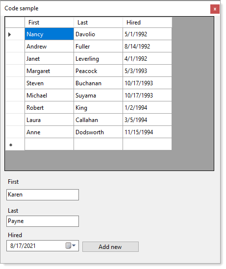

# About

A `conceptual example` which focuses on backend read and insert operations for a SQL-Server database table from a modified version of Microsoft's `NorthWind` database.

- Before running this project, create the database followed by running `SQL Scripts\script.sql`
- Why not add directly to the DataGridView new row? So to keep focus on the add operation and validation all in one method.
- Delete operation is a `soft delete`, not a `hard delete`, minor changes to make a hard delete although in the full database there is a `foreign key constraint` which will raise an exception for a hard delete. 

:triangular_flag_on_post: Screenshot is old, does not show the `remove button`

 

