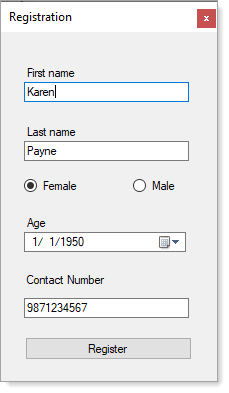

# About

Basic code sample for collecting information and storing in  SQL-Server database table.



**Table design**

```sql
CREATE TABLE dbo.People
(Id          INT IDENTITY(1, 1) NOT NULL, 
 FirstName   NVARCHAR(MAX) NULL, 
 LastName    NVARCHAR(MAX) NULL, 
 Gender      BIT NULL, 
 BirthDay    DATETIME2(7) NULL, 
 PhoneNumber NVARCHAR(MAX) NULL, 
 CONSTRAINT PK_People PRIMARY KEY CLUSTERED(Id ASC)
)
```

**Remarks**

- Only data operation is INSERT INTO and return new primary key
- Person container class is setup for notification change and basic data annotations

**SQL to view** 

Is imperfect in regards to age calculation, can be improved and stored in a Stored procedure. Phone number format will fail if data is not exact length.

```sql
SELECT Id, 
       FirstName, 
       LastName,
       CASE
           WHEN Gender = 1
           THEN 'Male'
           ELSE 'Female'
       END AS Gender, 
       FORMAT(BirthDay, 'MM/dd/yyyy') AS BirthDay, 
	   CONVERT(int,ROUND(DATEDIFF(hour,BirthDay,GETDATE())/8766.0,0)) AS Age,
       SUBSTRING(phoneNumber, 1, 3) + '-' + 
	   SUBSTRING(phoneNumber, 4, 3) + '-' + 
	   SUBSTRING(phoneNumber, 7, 4) AS PhoneNumber
FROM dbo.People;
```
