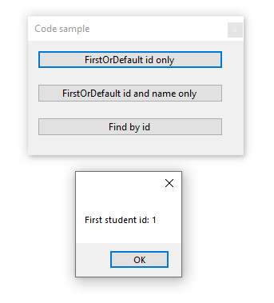

# About




Simple example to get the first record of a Student with two different ways using a `Deconstruct` and `discard`

Generally speaking we would check if the result from `FirstOrDefault` is `null` but here we know there are records.

Many don't know about `FindAsync` which is also a valid option.

All code keeps the user interface responsive. For a real application all data operations should reside in a data class, here I kept it simple, all code in a form.

```csharp
public void Deconstruct(out int identifier, out string name)
{
    identifier = StudentId;
    name = StudentName;
}
```

Form code

```csharp
using System;
using System.Threading.Tasks;
using System.Windows.Forms;
using Microsoft.EntityFrameworkCore;
using StudentSimpleEntityFramework.Data;

namespace StudentSimpleEntityFramework
{
    public partial class Form1 : Form
    {
        public Form1()
        {
            InitializeComponent();
        }

        private async void FirstOrDefaultIdButton_Click(object sender, EventArgs e)
        {
            await Task.Run(async () =>
            {
                await using (var context = new Context())
                {
                    var (identifier, _) = await context.Student.FirstOrDefaultAsync();
                    MessageBox.Show($"First student id: {identifier}");
                }
            });
        }

        private async void FirstOrDefaultIdNameButton_Click(object sender, EventArgs e)
        {
            await Task.Run(async () =>
            {
                await using (var context = new Context())
                {
                    var (identifier, name) = await context.Student.FirstOrDefaultAsync();
                    MessageBox.Show($"First student id: {identifier}\nName: {name}");
                }
            });
        }

        private async void FindByIdButton_Click(object sender, EventArgs e)
        {
            int studentIdentifier = 1;

            await Task.Run(async () =>
            {
                await using (var context = new Context())
                {
                    var (identifier, name) = await context.Student.FindAsync(studentIdentifier);
                    MessageBox.Show($"First student id: {identifier}\nName: {name}");
                }
            });
        }
    }
}
```