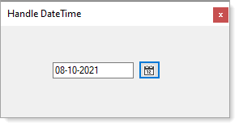
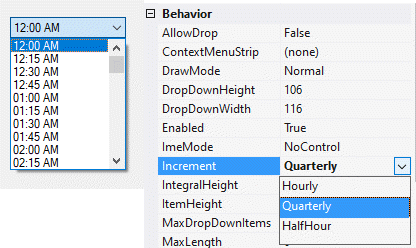

# About

To allow a `calendar` to be displayed where the Text input is disabled other than copying we use a child form to display a month calendar to allow a date to be selected. If time is needed this can be done too but is not included. See options in my Working with time [repository](https://github.com/karenpayneoregon/WorkingWithTimeInVisualStudio/tree/master/TimeLibrary) for a time ComboBox.

Decided to place the TimeComboBox under Classes folder and shown in Form2.

:heavy_check_mark: Written with .NET Framework 4.8 (will work in .NET Core 5), C#.

In the screenshot below the child form is positioned next to the button which called this form.

 

 

---

**TimeComboBox**

